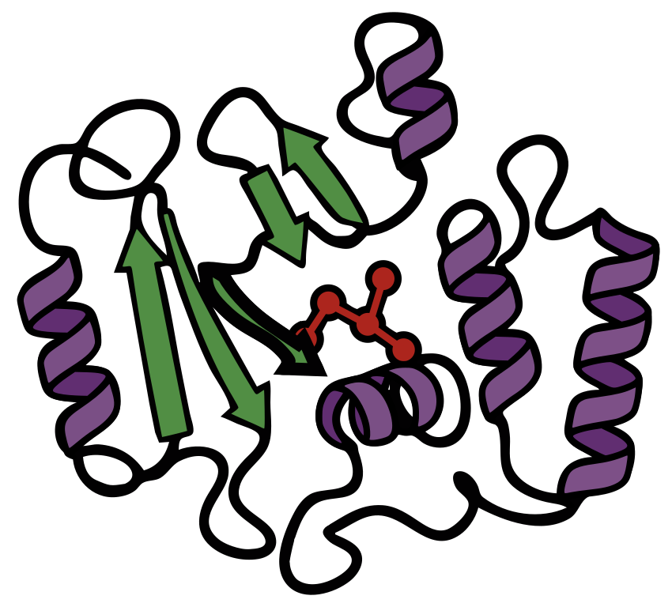

  

# LuxFold.jl

LuxFold.jl is a Julia framework for macromolecular structure prediction and folding, built on the Lux.jl deep learning library.

## Project Status

This repository is currently a work in progress. At this time, only the core module, **LuxFoldCore.jl**, and an initial implementation of the **AlphaFold2** model are available.

