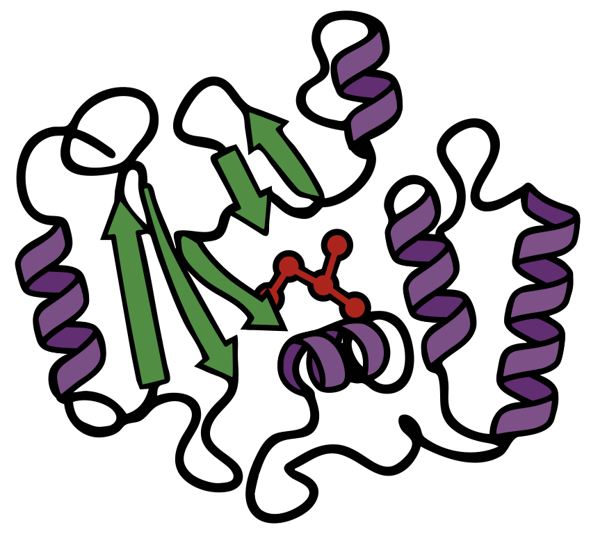

<p align="center">
  
</p>

# LuxFold.jl

LuxFold.jl is a Julia framework for macromolecular structure prediction, built on the [Lux.jl](https://github.com/LuxDL/Lux.jl) deep learning library. It provides a unified interface for running models AlphaFold2 (and, in future, AlphaFold3 and Boltz2) by providing a pipeline for data loading, template selection, and MSA loading.

## Repository Structure

This is a Julia monorepo containing several independently-versioned packages:

```
lib/
  LuxFoldCore/           Shared Lux layers (AdaLN, AttentionPairBias, OuterProductMean, …)
  AlphaFold2/            AlphaFold2 model implementation
  AlphaFold3/            Work-in-progress
  Boltz2/                Work-in-progress
  PythonTestHelpers/     Shared utilities for Python interop (weight sync, tensor conversion)
src/                     Top-level LuxFold.jl entry (data pipeline: PDB parsing, MSA, features)
```

## AlphaFold2 — Implementation Status

**AlphaFold2 is near completion.** All layers of the model have been implemented as standalone Lux components with numerical-parity tests against the OpenFold PyTorch reference at Float64, Float32, and Float16 precision.

### Model Architecture

| Component | Source Files | Tests | Status |
|-----------|-------------|-------|--------|
| **Embedders** — InputEmbedder, RecyclingEmbedder, ExtraMSAEmbedder, PreEmbeddingEmbedder, RelativePositionEncoding, full TemplateEmbedder pipeline | 9 | 10 | ✅ Complete |
| **Evoformer** — EvoformerBlock, EvoformerStack, ExtraMSABlock, ExtraMSAStack, MSAColumnAttention, MSAColumnGlobalAttention | 5 | 5 | ✅ Complete |
| **Heads** — DistogramHead, TMScoreHead, MaskedMSAHead, ExperimentallyResolvedHead, PerResidueLDDTCaPredictor, AuxiliaryHeads | 1 (6 layers) | 1 | ✅ Complete |
| **Structure Module** — InvariantPointAttention, BackboneUpdate, AngleResnet, StructureModuleTransition, StructureModule (full pipeline) | 5 | 5 | ✅ Complete |
| **Shared Layers** — Transition, MSATransition, PairTransition, PairStackBlock | 2 | 2 | ✅ Complete |
| **Utilities** — Rigid body algebra, geometry, atom utilities, torsion angles, scoring (pLDDT, PAE, pTM), residue constants | 7 | 5 | ✅ Complete |
| **Weight Loading** — Pure-Julia NPZ loader for official DeepMind checkpoints | 1 | Integration | 🚧 Initial draft |
| **Full Model** — `AlphaFold` struct, recycling loop, `predict()` | 1 | 2 integration | 🚧 Initial draft |

**Totals: 29 source files, 37 test files across 8 test groups.**

### Testing Strategy

All 29 source files have dedicated test files following a consistent pattern:

- **Python numerical parity** at Float64, Float32, and Float16 — every layer output is compared to the OpenFold reference after synchronising weights
- **Type-stability** checked via `@test_nowarn @inferred` for every layer
- **Mask parameterisation** — every layer is tested with `nothing` (no mask) and random `Bool` masks
- **Integration tests** validate the full model pipeline (shapes, absence of NaN, recycling semantics)

Test groups are ordered to respect dependencies (PairStackBlock helpers are shared by evoformer tests; layers are tested before the modules that compose them).

## Key Design Decisions

- **Channel-first layout**: Julia `[C, spatial..., B]` convention throughout, with `to_py`/`to_jl` helpers in `PythonTestHelpers` for Python interop.
- **Static dispatch**: `Static.jl` booleans (`static(true)`, `static(false)`) for compile-time branching on configuration parameters like `is_multimer`, `use_clamp`, `project_first`.
- **No standalone shape tests**: Shape and bias configuration are validated implicitly through Python numerical parity — if the output matches at three precisions, the setup is correct by construction.
- **Mask reshaping**: Masks over spatial dims (e.g., `[N, N, B]`) are reshaped to `[1, N, N, B]` before broadcasting against channel-first tensors.
- **Pure-Julia weight loading**: Official DeepMind `.npz` checkpoints are loaded via `NPZ.jl` — no Python runtime dependency at inference time.

## Getting Started

```julia
] add LuxFold
```

For AlphaFold2-specific usage:

```julia
using AlphaFold2, Lux, Random

# Default model (monomer, 8 recycling iterations)
model = AlphaFold2.AlphaFold()
rng = Random.Xoshiro(42)
ps, st = Lux.setup(rng, model)

# Single recycling iteration
result, st = iteration(model, features, ps, st)

# Full prediction loop
result = predict(model, features, ps, st; num_recycles=3)
```

See [lib/AlphaFold2/README.md](lib/AlphaFold2/README.md) for detailed documentation.

## Project Status

| Component | Status |
|-----------|--------|
| **LuxFoldCore** — Shared Lux layers | ✅ Stable |
| **AlphaFold2** — Model layers + tests | ✅ Complete |
| **AlphaFold2** — Weight loading | 🚧 In progress |
| **AlphaFold2** — Full model integration | 🚧 In progress |
| **Data pipeline** (PDB/mmCIF parsing, MSA, features) | 🚧 In progress |
| **AlphaFold3** | 🚧 In progress |
| **Boltz2** | 🚧 In progress |

## License

MIT — see [LICENSE](LICENSE).
